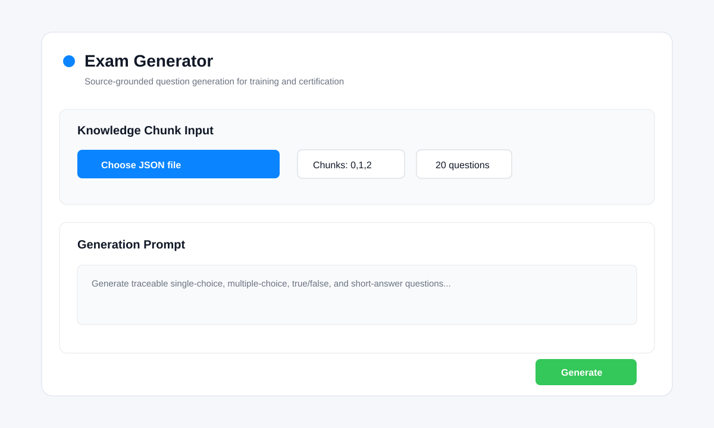
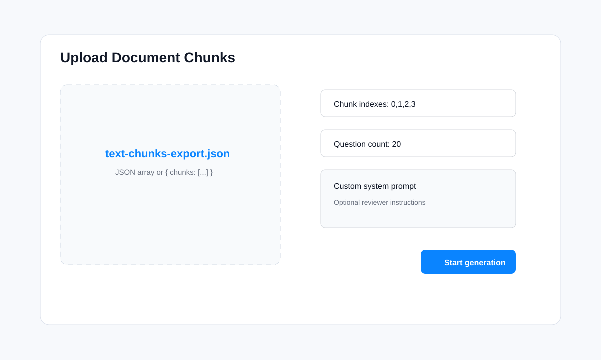
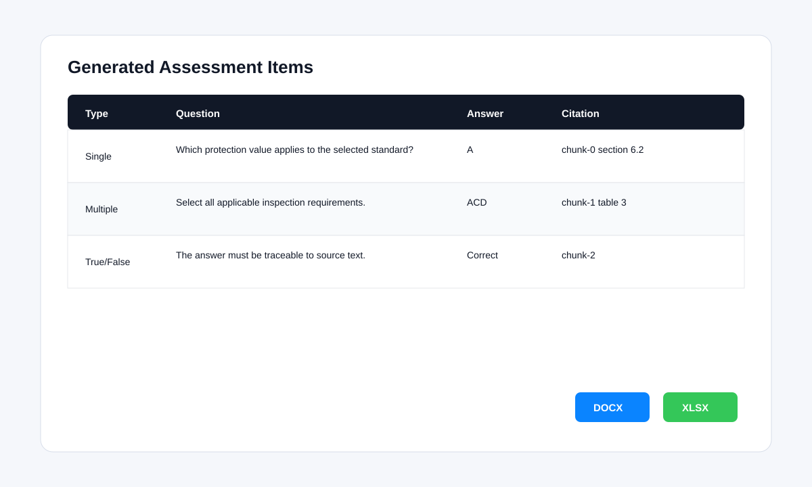
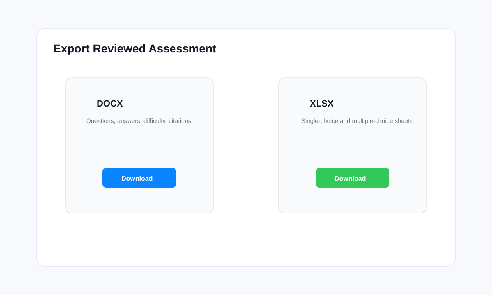
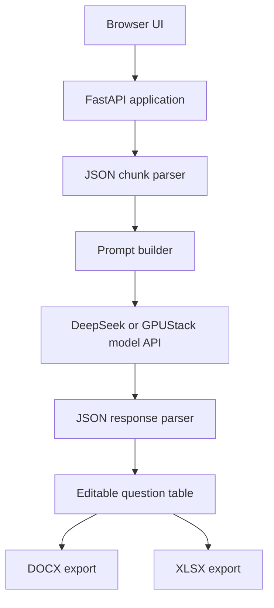
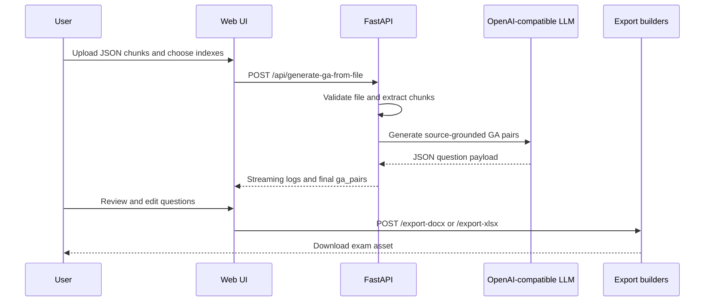

# Exam Generator

AI-powered knowledge assessment generator for training, certification, and technical knowledge-base evaluation. The project turns structured document chunks into traceable exam questions, lets reviewers edit the generated question set, and exports the result as DOCX or XLSX.

The current implementation is a FastAPI application with a single-page web UI, OpenAI-compatible model access through DeepSeek/GPUStack, JSON chunk ingestion, source-cited question generation, and document export.

## Why This Project Exists

Organizations often have a large body of manuals, standards, training materials, and internal knowledge-base content, but turning that material into high-quality assessment questions is slow and inconsistent. Exam Generator focuses on a practical RAG-adjacent workflow:

1. Parse or prepare knowledge-base content as JSON chunks.
2. Select the chunks that should be assessed.
3. Generate source-grounded questions with answers and citations.
4. Review and edit the result in a browser.
5. Export reusable exam assets for Word and spreadsheet workflows.

This makes the project useful for education, enterprise training, railway communication standards training, and any domain where question quality and source traceability matter.

## Features

- JSON knowledge chunk upload
- Chunk index selection for targeted assessment generation
- OpenAI-compatible LLM integration through DeepSeek/GPUStack
- Single-choice, multiple-choice, true/false, and short-answer questions
- Difficulty labels and source citations for every generated item
- Editable browser table before export
- DOCX export with questions, answers, difficulty, citations, and comments
- XLSX export with separated sheets for single-choice and multiple-choice questions
- Streaming generation logs for long-running model calls
- Health check endpoint for model connectivity
- Docker support

## Screenshots

These interface previews show the intended reviewer workflow.









## Architecture



## Data Flow



## Repository Structure

```text
.
├── main.py                         # FastAPI app, API routes, model calls, XLSX export
├── prompts.py                      # System prompt and user prompt construction
├── docx_utils.py                   # DOCX rendering and question type helpers
├── static/index.html               # Browser UI
├── text-chunks-export-2025-11-16.json
├── tests/                          # Unit tests for parser, generator, and exports
├── .github/workflows/test.yml      # CI test workflow
├── ROADMAP.md
├── CONTRIBUTING.md
└── LICENSE
```

## Quick Start

### 1. Install Dependencies

```bash
python -m venv .venv
source .venv/bin/activate  # Windows: .venv\Scripts\activate
pip install -r requirements.txt
```

### 2. Configure Environment

Copy the example file and set your model endpoint:

```bash
cp .env.example .env
```

Required variables:

```bash
GPUSTACK_API_KEY=your_api_key_here
GPUSTACK_BASE_URL=https://api.deepseek.com/v1
```

Optional variables:

```bash
DEEPSEEK_MODEL_NAME=deepseek-r1
GPUSTACK_TIMEOUT=120
GPUSTACK_MAX_RETRIES=2
CORS_ORIGINS=http://localhost:3000,http://localhost:8000
```

### 3. Run the App

```bash
uvicorn main:app --reload --host 0.0.0.0 --port 8833
```

Open:

```text
http://localhost:8833/static
```

### 4. Try the Sample Data

Upload `text-chunks-export-2025-11-16.json`, select the desired chunk indexes, generate questions, review the table, then export DOCX or XLSX.

## Docker

```bash
docker build -t exam-generator:latest .
docker run -p 8833:8833 \
  -e GPUSTACK_API_KEY=YOUR_API_KEY \
  -e GPUSTACK_BASE_URL=https://api.deepseek.com/v1 \
  -e DEEPSEEK_MODEL_NAME=deepseek-r1 \
  exam-generator:latest
```

Then open `http://localhost:8833/static`.

## API Overview

| Endpoint | Method | Purpose |
| --- | --- | --- |
| `/` | GET | Serve the main HTML page |
| `/api/deepseek-health` | GET | Check model API connectivity |
| `/api/system-prompt` | GET | Return the default generation prompt |
| `/api/generate-ga-from-file` | POST | Upload JSON chunks and generate questions |
| `/api/generate-ga` | POST | JSON API for programmatic generation |
| `/export-docx` | POST | Export reviewed GA pairs as DOCX |
| `/export-xlsx` | POST | Export reviewed GA pairs as XLSX |

## Input Format

The app accepts either a top-level array:

```json
[
  {
    "name": "chapter-1",
    "content": "Document text to assess..."
  }
]
```

or an object with a `chunks` field:

```json
{
  "chunks": [
    {
      "title": "chapter-1",
      "text": "Document text to assess..."
    }
  ]
}
```

Each chunk can use `content`, `text`, or `chunk` for the body. The UI accepts comma-separated indexes such as `0,1,2`.

## Output Format

The model is instructed to return:

```json
{
  "ga_pairs": [
    {
      "id": "q1",
      "question_type": "single_choice",
      "options": ["A. ...", "B. ...", "C. ...", "D. ..."],
      "question": "...",
      "ga_answer": "A",
      "difficulty": "easy",
      "source_excerpt": "...",
      "source_locator": "chapter-1 chunk-0",
      "comment": "..."
    }
  ]
}
```

## Testing

```bash
pip install -r requirements.txt pytest
pytest -q
```

The current tests cover chunk parsing, robust JSON extraction, multi-chunk generation orchestration, DOCX rendering, and XLSX export.

## Roadmap

See [ROADMAP.md](ROADMAP.md) for planned releases, including RAG retrieval, quality scoring, multilingual generation, teacher review workflows, and LMS integration.

## Contributing

Contributions are welcome. Good first areas include parser support, export formats, prompt quality, test coverage, and deployment documentation. See [CONTRIBUTING.md](CONTRIBUTING.md).

## License

This project is released under the [MIT License](LICENSE).

## Project Documentation

The longer technical wiki is available at [doc/WIKI.md](doc/WIKI.md).
