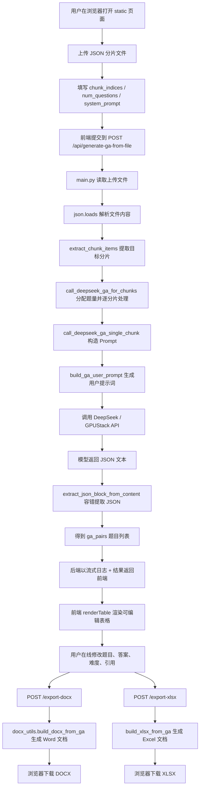
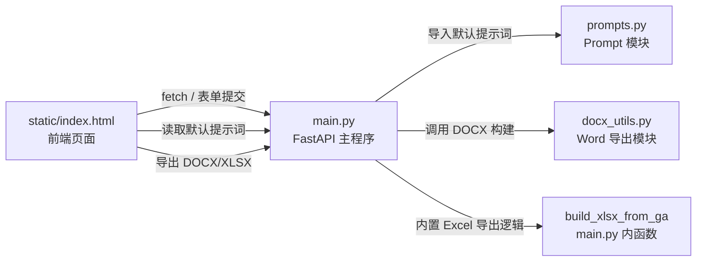

# exam_generator 项目 Wiki

## 1. 项目简介

`exam_generator` 是一个基于 **FastAPI + 静态前端页面 + OpenAI 兼容接口（DeepSeek / GPUStack）** 的考试题生成工具。

它的核心流程是：

1. 上传 JSON 文本分片；
2. 选择需要参与命题的分片索引；
3. 调用大模型生成 GA 对（题目 + 标准答案）；
4. 在前端页面中在线编辑题目；
5. 导出为 **DOCX** 和 **XLSX** 文件。

这个项目非常适合作为一个 **Python Web + AI 应用开发** 的教学案例，因为它同时覆盖了：

- Python 环境变量配置
- FastAPI 路由设计
- Pydantic 数据建模
- 文件上传
- 流式响应
- JSON 容错解析
- 第三方模型 API 调用
- Word / Excel 文档导出
- 前后端协作

---

## 2. 项目适合学习什么

从 Python 学习角度，本项目适合学习以下内容：

### 2.1 Python 基础能力

- 函数封装
- 列表与字典处理
- 字符串清洗
- 正则表达式
- JSON 编解码
- 异常处理 `try/except`

### 2.2 Python Web 开发

- FastAPI 应用创建
- 接口定义
- 表单上传与 JSON API
- 中间件编写
- 静态文件挂载
- 响应类型控制

### 2.3 工程化能力

- 环境变量管理
- 日志输出
- 配置清洗与校验
- 安全限制（大小限制、参数限制）
- 文档导出能力封装

### 2.4 AI 应用开发

- Prompt 设计
- 大模型返回 JSON 的约束
- 模型响应容错解析
- 多分片任务分配与汇总

---

## 3. 项目目录结构

当前仓库的核心结构如下：

```text
exam_generator/
├── main.py
├── prompts.py
├── docx_utils.py
├── static/
│   └── index.html
├── requirements.txt
├── Dockerfile
├── .env.example
├── README.md
└── text-chunks-export-2025-11-16.json
```

各文件职责概览：

- `main.py`：FastAPI 服务入口、配置读取、DeepSeek 调用、导出接口
- `prompts.py`：默认系统提示词与用户提示词构造
- `docx_utils.py`：DOCX 文档构建与题型排序
- `static/index.html`：前端页面，负责上传、编辑、导出
- `requirements.txt`：Python 依赖定义
- `text-chunks-export-2025-11-16.json`：示例分片数据

---

## 4. 系统整体架构

本项目可以按职责划分为 4 个层次：

1. **前端交互层**
   - `static/index.html`
   - 负责文件上传、连接检测、进度条、在线编辑和导出触发

2. **后端 API 层**
   - `main.py`
   - 负责接收请求、校验数据、组织调用链、返回结果

3. **模型调用层**
   - `main.py + prompts.py`
   - 负责拼接 Prompt、调用 DeepSeek / GPUStack、解析模型返回

4. **导出层**
   - `docx_utils.py`
   - `main.py` 中的 Excel 构建函数
   - 负责将 GA 对导出为 Word 与 Excel

---

## 5. 数据流框图

下面给出项目的核心数据流。该图可直接由 GitHub 渲染：



---

## 6. 模块关系图

下面是项目主要模块之间的关系：



如果从职责角度理解：

- `static/index.html` 是用户入口
- `main.py` 是总调度中心
- `prompts.py` 提供模型提示词模板
- `docx_utils.py` 提供文档导出能力

---

## 7. 各模块详细说明

## 7.1 `main.py`：后端主模块

这是项目最核心的文件，职责包括：

- 初始化 FastAPI
- 读取环境变量
- 建立 OpenAI 客户端
- 提供 API 路由
- 处理文件上传
- 调用 DeepSeek
- 解析模型返回
- 导出 DOCX / XLSX

### 7.1.1 配置区

配置相关函数包括：

- `_clean_env_value(raw, name)`
- `_normalize_base_url(raw, name)`
- `_get_first_env(names, required_name=...)`

这些函数的作用：

- 去除环境变量两端空格
- 检查 `base_url` 是否以 `http://` 或 `https://` 开头
- 支持多个环境变量名兼容读取

这是一个很好的 Python 教学点：**配置项不要直接使用，要先清洗与校验。**

### 7.1.2 应用初始化区

包括：

- `app = FastAPI(...)`
- CORS 中间件配置
- 安全头中间件 `SecurityHeadersMiddleware`
- `app.mount("/static", ...)`

教学意义：

- 演示了如何创建 FastAPI 服务
- 演示了如何挂载静态页面
- 演示了如何为所有响应添加安全头

### 7.1.3 数据模型区

项目使用 Pydantic 定义了多个数据模型：

- `GAPair`
- `ExportDocxRequest`
- `ExportXlsxRequest`
- `GARequest`

这些模型的作用：

- 校验输入结构
- 约束字段长度与数量
- 提升代码可读性与可维护性

### 7.1.4 工具函数区

`main.py` 中包含多种工具函数，用于实现：

- 分片提取
- JSON 容错解析
- 模型调用
- 题型识别
- Excel 导出

这一部分构成了后端的业务核心。

### 7.1.5 路由区

`main.py` 中定义了以下主要接口：

- `GET /`
- `GET /api/deepseek-health`
- `GET /api/system-prompt`
- `POST /api/generate-ga-from-file`
- `POST /api/generate-ga`
- `POST /export-docx`
- `POST /export-xlsx`

---

## 7.2 `prompts.py`：提示词模块

该模块专门负责管理 Prompt。

### 核心内容

#### `GA_SYSTEM_PROMPT`

定义系统提示词，用于告诉模型：

- 你的角色是什么
- 你应该生成什么类型的题
- 输出 JSON 的结构必须是什么
- 各类题型的约束是什么

#### `build_ga_user_prompt(merged_text, num_questions)`

负责拼接用户提示词，把：

- 分片正文
- 题目数量要求
- 输出格式要求

组合成一次完整的模型输入。

### 教学意义

这是一个典型的“提示词工程与业务逻辑解耦”设计：

- `main.py` 负责流程控制
- `prompts.py` 负责提示词策略

这样更容易维护，也更方便后续替换模型。

---

## 7.3 `docx_utils.py`：Word 导出模块

该模块负责把 GA 对渲染为 Word 文档。

### 核心职责

- 规范化选项
- 清洗公式格式
- 题型映射
- 题目排序
- 构建 DOCX 文档

### 主要函数

- `_normalize_options(raw)`
- `_sanitize_math_markdown(text)`
- `_render_question_type(raw)`
- `_replace_type_tokens(text)`
- `sort_ga_pairs_by_type(ga_pairs)`
- `build_docx_from_ga(ga_pairs, title)`

### 教学意义

该模块很好地展示了：

- 如何把“数据处理逻辑”和“文档展示逻辑”分离
- 如何把复杂格式输出封装成独立工具模块

---

## 7.4 `static/index.html`：前端页面模块

前端虽然只有一个 HTML 文件，但它承担了完整交互流程：

- 文件上传
- 参数填写
- 连接检测
- 进度条展示
- 状态日志展示
- 表格编辑
- 导出 DOCX / XLSX

### 前端核心函数

- `loadDefaultSystemPrompt()`
- `renderTable()`
- `collectGAPairsFromTable()`
- `startProgress()`
- `finishProgress()`
- `showErrors()`
- `renderStatusLog()`
- `appendStatusLog()`
- `setConnectionState()`
- `checkConnection()`
- `parseChunksLength()`

### 教学意义

这个文件展示了一个“小而完整”的前端单页应用：

- 使用 `fetch()` 与后端通信
- 使用 `FormData` 提交文件
- 使用流式响应读取实时日志
- 把表格中的编辑结果重新收集为 JSON

---

## 8. 关键函数详解

下面列出项目中最有教学价值的关键函数。

### 8.1 `extract_chunk_items(chunks, indices)`

作用：

- 根据用户指定索引，从全部分片中提取目标分片
- 将原始分片标准化为统一结构

输出结构示意：

```json
{
  "index": 0,
  "title": "chunk-0",
  "text": "这一分片的正文"
}
```

教学点：

- 列表遍历
- 容错字段读取（`content` / `text` / `chunk`）
- 数据标准化

---

### 8.2 `extract_json_block_from_content(content)`

作用：

- 从大模型返回文本中，尽量提取一个合法 JSON 对象

为什么它很重要：

- 大模型并不总是严格只返回 JSON
- 可能会夹杂自然语言说明
- 需要做括号匹配与容错解析

核心思路：

1. 优先寻找 `{"ga_pairs"` 开头位置
2. 如果找不到，则从第一个 `{` 开始
3. 通过括号深度匹配找到 JSON 结束位置
4. 再执行 `json.loads`

教学点：

- 字符串扫描
- 状态机思想
- 括号匹配
- 健壮解析

---

### 8.3 `call_deepseek_ga_single_chunk(...)`

作用：

- 对单个分片调用模型生成 GA 对

流程：

1. 选择系统提示词
2. 构造用户提示词
3. 调用 `client.chat.completions.create(...)`
4. 超时 / 连接失败时重试
5. 尝试解析模型返回 JSON
6. 返回 `ga_pairs` 与错误信息

教学点：

- 第三方 API 调用
- 重试机制
- 异常分类处理
- `(结果, 错误)` 这样的返回值设计

---

### 8.4 `call_deepseek_ga_for_chunks(...)`

作用：

- 对多个分片进行批量命题
- 将总题量平均分配到各分片

流程：

1. 计算每个分片的题量分配
2. 循环调用 `call_deepseek_ga_single_chunk`
3. 对每道题补充 `source_locator`
4. 汇总所有题目与错误信息

教学点：

- 任务拆分
- 批处理
- 结果聚合
- 失败不中断整体流程

---

### 8.5 `generate_ga_from_file(...)`

作用：

- 处理前端上传文件
- 生成题目
- 以流式形式返回日志和最终结果

这是项目里最接近真实工程接口的函数。

主要步骤：

1. 校验文件类型
2. 读取文件内容
3. 校验文件大小
4. 解析 JSON
5. 解析分片索引
6. 提取有效分片
7. 调用模型生成题目
8. 通过 `StreamingResponse` 把日志逐行返回前端

教学点：

- FastAPI 文件上传
- `asyncio.Queue`
- `asyncio.to_thread`
- `StreamingResponse`
- 前后端实时通信

---

### 8.6 `build_docx_from_ga(ga_pairs, title)`

作用：

- 将 GA 对导出为 Word 文档

输出结构包括：

1. 试题部分（不含答案）
2. 参考答案与原文引用部分

教学点：

- 文档对象建模
- 遍历结构化数据并渲染
- 显示层与数据层分离

---

### 8.7 `build_xlsx_from_ga(ga_pairs)`

作用：

- 将 GA 对导出为 Excel 文件

特点：

- 按题型分 Sheet
- 单选题和多选题分别写入不同工作表
- 自动设置表头样式、边框、列宽

教学点：

- Excel 报表生成
- 结构化数据输出
- `openpyxl` 的基础使用方式

---

## 9. API 设计说明

## 9.1 `GET /`

返回首页 HTML 页面。

用途：

- 浏览器访问时进入前端工具页

---

## 9.2 `GET /api/deepseek-health`

检查 DeepSeek / GPUStack 连接状态。

返回字段包括：

- `ok`
- `message`
- `models`

用途：

- 前端页面加载时用于检测服务可用性

---

## 9.3 `GET /api/system-prompt`

返回后端默认系统提示词。

用途：

- 前端自动加载默认 Prompt，并允许用户编辑

---

## 9.4 `POST /api/generate-ga-from-file`

网页上传版生成接口。

表单参数：

- `file`
- `chunk_indices`
- `num_questions`
- `system_prompt`

特点：

- 支持上传 JSON 文件
- 支持流式返回日志和结果
- 适合浏览器交互

---

## 9.5 `POST /api/generate-ga`

纯 JSON 请求版接口。

请求体包含：

- `chunks`
- `chunk_indices`
- `num_questions`
- `system_prompt`

适合场景：

- 脚本调用
- Pipeline 对接
- 系统与系统联动

---

## 9.6 `POST /export-docx`

接收前端编辑后的 `ga_pairs`，导出 Word 文件。

---

## 9.7 `POST /export-xlsx`

接收前端编辑后的 `ga_pairs`，导出 Excel 文件。

---

## 10. 前后端交互流程

### 步骤 1：页面初始化

页面加载后，前端会主动调用：

- `checkConnection()`
- `loadDefaultSystemPrompt()`

目的：

- 检测后端和模型服务是否可用
- 获取默认系统提示词

### 步骤 2：用户选择 JSON 文件

前端通过 `FileReader` 读取 JSON 内容，并尝试识别：

- 顶层数组长度
- 或 `chunks` 字段中的数组长度

然后自动填充分片索引。

### 步骤 3：提交生成请求

前端使用 `FormData` 提交到：

- `POST /api/generate-ga-from-file`

后端开始处理分片，并通过流式响应持续返回：

- 日志消息
- 错误消息
- 最终题目结果

### 步骤 4：表格渲染

前端收到 `ga_pairs` 后，调用 `renderTable()`：

- 生成可编辑表格
- 启用导出按钮

### 步骤 5：导出文件

前端通过 `collectGAPairsFromTable()` 收集修改后的内容，再发送到：

- `POST /export-docx`
- `POST /export-xlsx`

---

## 11. Python 教学视角总结

从教学角度，这个项目有几个非常值得学习的工程实践。

### 11.1 配置读取要先清洗

例如：

- `_clean_env_value`
- `_normalize_base_url`

说明一个重要思想：**外部输入永远不应被直接信任。**

### 11.2 输入要做边界限制

项目中对以下内容做了约束：

- 文件大小
- JSON 大小
- 重试次数
- 超时时间
- 题目数量
- 数组最大长度

这体现了工程代码的稳定性意识。

### 11.3 工具函数职责要清晰

例如：

- `extract_chunk_items` 只负责提取分片
- `extract_json_block_from_content` 只负责 JSON 容错解析
- `call_deepseek_ga_single_chunk` 只负责单分片模型调用
- `call_deepseek_ga_for_chunks` 只负责批量调度

这体现了“单一职责原则”。

### 11.4 前后端解耦

前端只关心：

- 上传什么
- 展示什么
- 导出什么

后端只关心：

- 接收参数
- 调用模型
- 返回结构化结果

这是典型的分层设计。

### 11.5 AI 接口返回要做容错

大模型并不总会严格按预期返回 JSON，因此项目增加了：

- JSON 直接解析
- 括号匹配提取
- 错误日志回传

这对于 AI 应用开发是非常重要的实战经验。

---

## 12. 可优化方向

本项目已经具备完整功能，但仍有若干可持续优化点：

### 12.1 拆分 `main.py`

当前 `main.py` 体量较大，可以进一步拆分为：

- `config.py`
- `schemas.py`
- `services/deepseek_service.py`
- `services/export_service.py`
- `routers/api.py`

### 12.2 增加自动化测试

建议为以下功能增加单元测试：

- `extract_chunk_items`
- `extract_json_block_from_content`
- 题型判断函数
- DOCX / XLSX 导出函数

### 12.3 增加并发处理

当前分片处理采用串行调用。若模型服务允许，可以考虑引入受控并发，提高整体生成速度。

### 12.4 增加更多题型

目前系统主要支持：

- 单选题
- 多选题
- 判断题
- 简答题

未来可以扩展：

- 填空题
- 案例分析题
- 组合题

### 12.5 增加更清晰的文档体系

例如继续补充：

- Prompt 设计说明
- API 示例请求与响应
- Docker 部署说明
- 常见错误排查指南

---

## 13. 初学者阅读顺序建议

如果你是 Python 初学者，建议按以下顺序阅读源码：

### 第一阶段：先看整体

1. `README.md`
2. `static/index.html`
3. `main.py` 的路由部分

目标：先理解这个系统“做什么”。

### 第二阶段：看主流程

重点阅读：

1. `generate_ga_from_file`
2. `extract_chunk_items`
3. `call_deepseek_ga_for_chunks`
4. `call_deepseek_ga_single_chunk`

目标：理解“上传文件 -> 调模型 -> 返回结果”的主链路。

### 第三阶段：看工具模块

1. `prompts.py`
2. `docx_utils.py`
3. `build_xlsx_from_ga`

目标：理解提示词、文档导出与报表导出逻辑。

### 第四阶段：尝试自己动手改造

建议练习：

- 把默认题量从 20 改成 10
- 给前端增加“删除题目”按钮
- 给 Excel 增加判断题工作表
- 把 `main.py` 拆分成多个模块
- 调整 Prompt 让题目更偏向定义题或数值题

---

## 14. 总结

`exam_generator` 是一个非常适合作为 **Python + FastAPI + AI 应用开发入门案例** 的项目。

它的优势在于：

- 功能链路完整
- 输入输出明确
- 包含前端、后端、AI 调用、导出能力
- 具有很强的教学价值和改造空间

从学习者视角，它能帮助建立这样一条完整认知链：

> 数据输入 → 后端接收 → 数据清洗 → 模型调用 → 结果解析 → 前端展示 → 文档导出

这正是许多真实 Python AI 工具项目的标准形态。

如果后续继续演进，这个项目也很适合作为：

- 企业内部知识题库生成器
- 培训考试系统原型
- AI 文档处理与结构化输出教学样例

---

## 附：推荐的后续文档扩展方向

如果项目未来继续完善，建议在 `docs/` 目录下继续补充：

- `docs/api.md`
- `docs/deployment.md`
- `docs/prompt-design.md`
- `docs/troubleshooting.md`

这样可以把当前 `wiki.md` 作为总览页，逐步发展成完整的项目文档体系。
